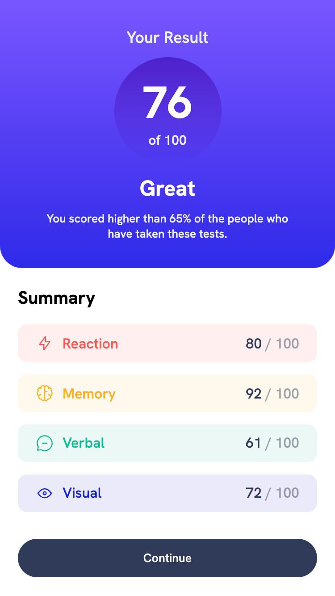
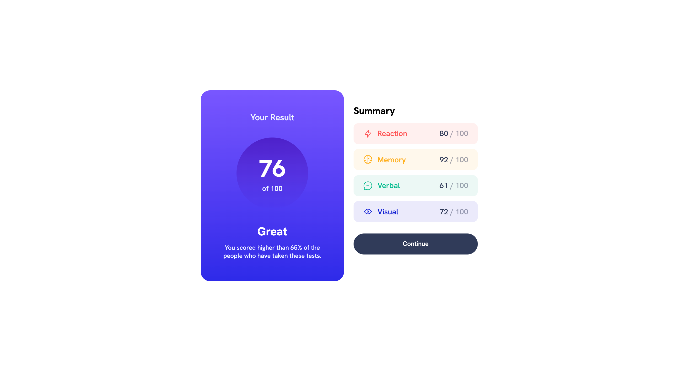

# Frontend Mentor - Results summary component solution

This is a solution to the [Results summary component challenge on Frontend Mentor](https://www.frontendmentor.io/challenges/results-summary-component-CE_K6s0maV). Frontend Mentor challenges help you improve your coding skills by building realistic projects. 

## Table of contents

- [Frontend Mentor - Results summary component solution](#frontend-mentor---results-summary-component-solution)
  - [Table of contents](#table-of-contents)
  - [Overview](#overview)
    - [The challenge](#the-challenge)
    - [Screenshot](#screenshot)
    - [Links](#links)
  - [My process](#my-process)
    - [Built with](#built-with)
    - [What I learned](#what-i-learned)
  - [Author](#author)
  - [Acknowledgments](#acknowledgments)

## Overview

### The challenge

- Responsive website
- Gradient background

### Screenshot

<strong>Mobile View</strong>

<strong>Desktop View</strong>

<strong>Active State</strong>

### Links

- Solution URL: [Testimonials Grid Section with Sass and Grid Layout](https://www.frontendmentor.io/solutions/testimonials-grid-section-with-sass-and-grid-layout-t8Tp_t8ZY7)
- Live Site URL: [Frontend Mentor | Testimonials Grid Section](https://vangmanawkairung.github.io/Frontend-Mentor_testimonials-grid-section/)

## My process

### Built with

- Semantic HTML5 markup
- CSS custom properties
- Flexbox
- Sass/Scss

### What I learned

- How to create gradient background

## Author

- Frontend Mentor - [@VangmanawKairung](https://www.frontendmentor.io/profile/VangmanawKairung)
- GitHub - [VangmanawKairung](https://github.com/VangmanawKairung)

## Acknowledgments

I appreciate to Frontend Mentor Team for spending the time to make this challenge.