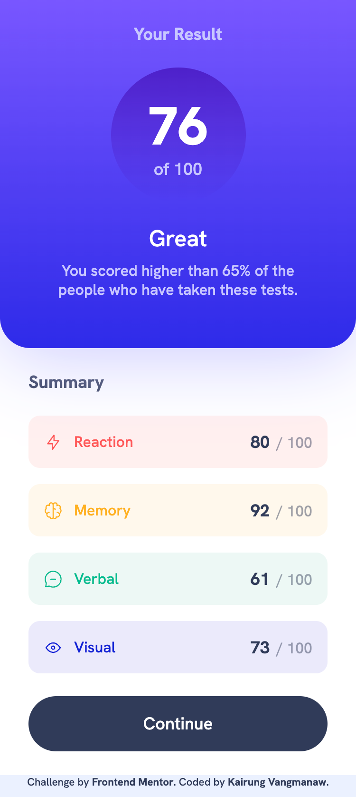
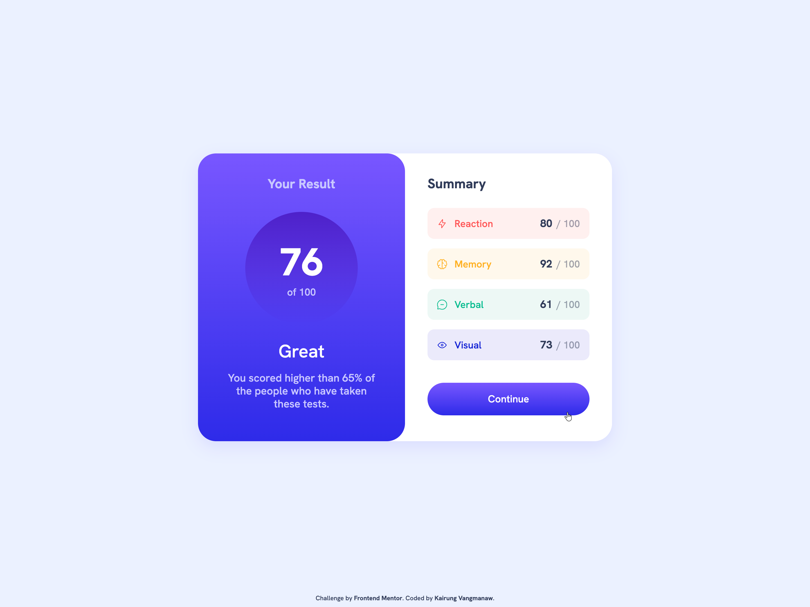

# Frontend Mentor - Results summary component solution

This is a solution to the [Results summary component challenge on Frontend Mentor](https://www.frontendmentor.io/challenges/results-summary-component-CE_K6s0maV). Frontend Mentor challenges help you improve your coding skills by building realistic projects. 

## Table of contents

- [Frontend Mentor - Results summary component solution](#frontend-mentor---results-summary-component-solution)
  - [Table of contents](#table-of-contents)
  - [Overview](#overview)
    - [The challenge](#the-challenge)
    - [Screenshot](#screenshot)
    - [Links](#links)
  - [My process](#my-process)
    - [Built with](#built-with)
    - [What I learned](#what-i-learned)
    - [Continued development](#continued-development)
    - [Useful resources](#useful-resources)
    - [AI Collaboration](#ai-collaboration)
  - [Author](#author)
  - [Acknowledgments](#acknowledgments)

## Overview

### The challenge

Users should be able to:

- View the optimal layout for the interface depending on their device's screen size
- See hover and focus states for all interactive elements on the page
- **Bonus**: Use the local JSON data to dynamically populate the content

### Screenshot

  
Mobile view

  

  
Desktop view

  

  
Active state view

  

### Links

- Solution URL: [Result summary component built with React & Vite, using BEM](https://www.frontendmentor.io/solutions/result-summary-card-using-html-and-css-sass-XfakBL63ME)
- Live Site URL: [Frontend Mentor | Results summary component](https://challenged-by-frontend-mentor.github.io/result-summary-component/)

## My process

### Built with

- Semantic HTML5 markup
- CSS Custom Properties (CSS variables)
- Flexbox & CSS Grid
- Mobile-first workflow
- BEM methodology
- [React](https://react.dev/) - JS library
- [Vite](https://vite.dev/) - Frontend build tool

### What I learned

During this project, I really leveled up my skills in structuring scalable and maintainable front-end code. I learned how to effectively combine React components with strict BEM methodology to keep styles modular and avoid specificity issues. One of the key takeaways was mastering CSS relative color syntax (`hsl(from ... h s l / 0.1)`) to handle dynamic background opacities cleanly based on theme variables. I also gained a deeper understanding of accessibility standards, ensuring proper semantic HTML landmarks and focus states for keyboard navigation.

### Continued development

I want to continue improving my component architecture and exploring advanced animations or interactive states in future React projects. I also plan to practice integrating data fetching and handling more complex state logic to make my user interfaces even more robust.

### Useful resources

- [MDN Web Docs - HSL color value](https://developer.mozilla.org/en-US/docs/Web/CSS/Reference/Values/color_value/hsl) - This helped me understand and utilize modern CSS relative color syntax for dynamic theme opacities.

### AI Collaboration

Throughout this challenge, AI tools were utilized efficiently as part of the development workflow:

- Gemini: Used for brainstorming component structures, reviewing BEM naming conventions, and refining CSS architectural decisions.

- Google Search AI Mode: Used for looking up technical documentation and verifying modern CSS specifications.

## Author

- GitHub: [Kairung Vangmanaw](https://github.com/VangmanawKairung)
- Frontend Mentor - [@VangmanawKairung](https://www.frontendmentor.io/profile/VangmanawKairung)

## Acknowledgments

First of all, I want to thank myself for putting in the dedication, focus, and effort to build this project clean and solid from scratch. A huge thanks to my family for their continuous support, and to the Frontend Mentor team for providing such well-crafted design challenges. I also want to give a shout-out to macOS Preview, which came in super handy for quickly checking pixel dimensions and inspecting spacing values—saving a lot of time compared to blind trial and error. Lastly, gratitude to all the developer tools, browsers, and documentation that made this smooth development journey possible.